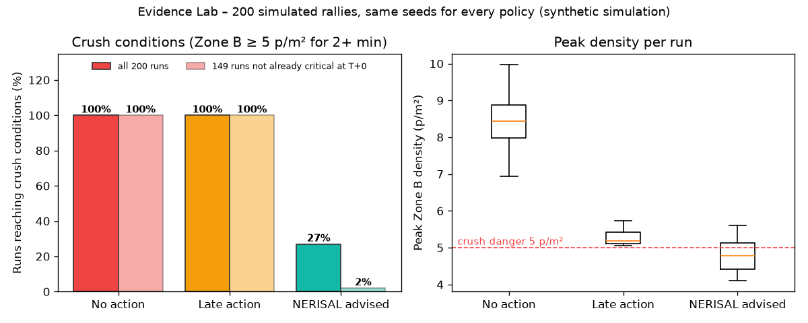
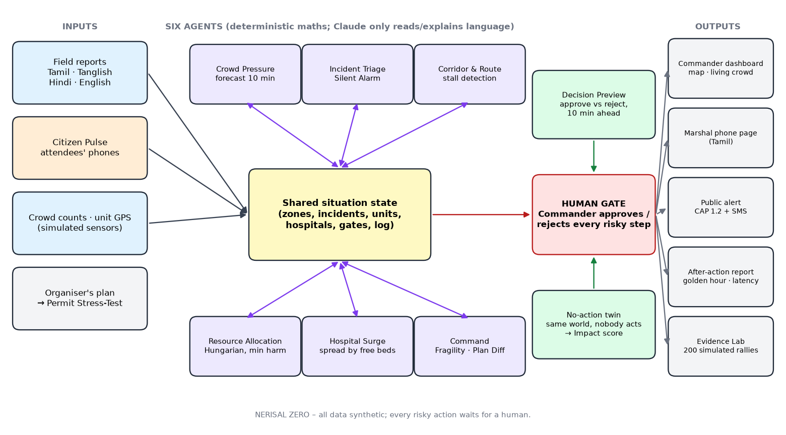

# NERISAL ZERO — Team WINNERS · GATEWAYS 2026 · Domain 4 (Crisis Command)

**நெரிசல் = crowd crush. NERISAL ZERO sees a crowd crush coming, lets the commander test each decision before taking it,
and re-plans the whole emergency response live — with a human approving every risky step.**

**Live demo: https://nerisal-zero.vercel.app** · attendee page: https://nerisal-zero.vercel.app/pulse · Demo video: (link)

## Why it matters
- **120+ people died in stampedes in India in 2025.** At Karur, Tamil Nadu, 41 died.
- **The warnings existed but nobody added them up.** Itaewon, Seoul 2022: 11 emergency calls from about 3 h 40 min before the crush; police were sent only 4 times.
- **Detection is not the gap, response capacity is.** Maha Kumbh 2025: 2,760 AI cameras sent alerts, but when officers rushed to one spot, another stampede started elsewhere.
- **Ambulances could not get through.** Karur: about 3× the expected crowd, a ~7-hour delay, heat and a power cut; ambulances were surrounded by the crowd.
- **Prevention starts at the permit.** After Karur, the Madras High Court ordered Tamil Nadu to frame an SOP for rallies.

## Proof
**Evidence Lab** (`python backend/evidence.py --n 200`, 21 s on a laptop): 200 randomised rallies, the same seeds for every policy.
Acting on NERISAL's first warnings kept Zone B out of crush conditions in **73 %** of runs, vs **0 %** with no
action and **0 %** with late action. 51 runs were already at crush density when monitoring began
(no warning can prevent those); of the other 149, **98 %** stayed safe with NERISAL's advice.
Median peak Zone B density: 8.45 p/m² with no action → 4.79 p/m² with advice.
*Synthetic model-based simulation, not real-world validation.*

## Try it in 60 seconds
1. Install Python 3.10+ (python.org, tick "Add Python to PATH").
2. **Windows:** double-click `run_windows.bat` · **Mac/Linux:** `./run_mac_linux.sh` · **Manual:** `pip install -r requirements.txt` → `cd backend` → `python -m uvicorn app:app --port 8000`
3. Open **http://localhost:8000** and press **🎬 Demo mode** (or `?` for keyboard shortcuts).

Other pages: **/marshal?zone=B** (ground marshals) and **/pulse** (attendees). For phones on the same Wi-Fi, start uvicorn with
`--host 0.0.0.0` and scan the QR code in the Citizen Pulse card. Optional Claude triage: set `ANTHROPIC_API_KEY`. Without it the
offline Tamil/Tanglish/Hindi/English rule parser runs. Map tiles, voice input and Claude need internet; everything else works offline.

## Deploy online (free)
Live on Vercel: **https://nerisal-zero.vercel.app** (redeploy: `npx vercel deploy --prod`; config in `vercel.json`, `pyproject.toml`, `main.py`). Alternative:

One click, sign in with GitHub, and Render builds it from `render.yaml` (about 5 minutes). Notes: the free tier sleeps after
15 minutes idle, so open the link a minute before judging; everyone who opens the link shares the same simulation (press Reset
before your demo); the Citizen Pulse QR then points to the public URL, so any phone can join.

## Features (one line each)
- **Crowd forecast**: density per zone and a 10-minute forecast, with heat, delay and power loss as aggravating factors.
- **Decision Preview 🔮**: every approval card simulates approve vs reject 10 minutes ahead before the human clicks.
- **No-action twin + Impact card**: the same world with nobody acting; crush, casualties and people-minutes above 5 p/m², side by side.
- **Silent Alarm**: 3+ crowding reports from one zone in 15 min become one high-priority alarm (the Itaewon lesson).
- **Citizen Pulse**: attendees tap "I'm OK / Can't move / Medical / Lost child" on /pulse; patterns become Triage reports; each phone gets calm advice for its zone.
- **Coverage gaps + Fragility**: which zones have no free police or first aid, and how the plan survives the next shock; mass-casualty → mutual aid.
- **Stall detection**: an ambulance that stops moving for 2 min is noticed without any report, and police are sent (the Karur lesson).
- **Golden hour**: every red/yellow patient from injury to hospital. No action → only 1 of 5 red patients in hospital by T+30; opening Gate 4 at T+10 → the first crush patient reaches hospital at T+20.
- **Hospital Surge**: patients spread by free beds instead of "everyone to the nearest hospital".
- **Living crowd view**: animated dots (1 ≈ 50 people) pack toward the stage and drain through Gate 4 when it opens.
- **Public alert**: CAP 1.2 XML (the international public-warning standard) in Tamil + English, plus a 160-character SMS; always labelled Exercise.
- **Permit Stress-Test**: test the organiser's plan at 1×, 2× and 2.7× turnout before granting permission.
- **After-action report**: timeline, who approved what and how long each alert waited (decision latency), golden-hour table; printable.
- **Evidence Lab**: 200 simulated rallies × 3 human policies (tab "Evidence").
- **Replay scrubber**: drag back to any minute to show when each warning appeared; release to return to live.
- **Presenter mode + shortcuts**: `A+` for 20 % bigger text; Space, N, R, P, A, E, F keys.

## Honest limits
All data is synthetic; hospital capacities and crowd numbers are not real. The crowd model is a zone-flow model, not physics.
Density thresholds and the permit model's assumptions are editable planning values, not official standards. The Evidence Lab tests
the model against itself on randomised inputs; it is not real-world validation.

## Project files
- `CLAUDE.md` – project brief for Claude Code (read automatically).
- `docs/BRAINSTORM.md` – the research behind every feature, and the "what next" list. `docs/JUDGE_QA.md`, `docs/PITCH.md`.
- `docs/DEMO_CHECKLIST.md` – click-by-click demo runs and the recovery plan.
- `tests/` – demo invariants. `python -m pytest -q` must stay green.

---

## What's inside — six agents + four "out of the box" layers

| Agent | Job |
|---|---|
| Crowd Pressure | density per zone, 10-min forecast (heat, delay, power loss aggravate), gate/halt proposals, Tamil/English/Hindi announcements |
| Incident Triage | multilingual reports → structured incidents, duplicate merge, **Silent Alarm** |
| Corridor & Route | road graph; crowd slows vehicles; Gate 4 corridor; blocked roads; **stall detection** |
| Resource Allocation | Hungarian-algorithm assignment minimising expected harm; switch penalty; unmet needs shown |
| Hospital Surge | spreads casualties by free beds; compares with "nearest-only" |
| Command | Fragility Score, **coverage gaps**, Plan Diff, reasons, human-approval gate |

| Layer | Research it answers |
|---|---|
| 🔮 **Decision Preview** – every approval card can simulate approve vs reject 10 min ahead | Human-in-the-loop must be informed, not a rubber stamp |
| **No-action twin** – same scenario running in parallel with nobody acting; chart + after-action report | Proves the value of each decision |
| **Silent Alarm** – 3+ crowding reports from one zone in 15 min = one pattern alarm | Itaewon 2022: 11 calls in ~4 hours before the crush, handled one by one |
| **Coverage gaps + Fragility** – which zones have no free police / first aid; stress-test vs next shock | Kumbh 2025: AI cameras alerted, but police rushing to one spot left another uncovered |
| **Stall detection** – responding ambulance stops moving for 2 min → detected with no report | Karur 2025: ambulances surrounded and immobilised |
| **Permit Stress-Test** – test the organiser's plan at 1×/2×/2.7× turnout before permission | Karur: ~3× the expected crowd, 7-hour delay |
| **After-action report** – timeline, who approved what, decision latency, printable | Accountability without blame |
| **Marshal phone view** – big Tamil instructions per zone | Alerts must reach the people on the ground |

---

## Demo script (8 minutes) — rehearse exactly

**0. Open (30 s).** "41 people died at Karur, 120+ in Indian stampedes in 2025. Every warning was visible. Nobody added them up."

**1. Before the event (1 min) — Permit test tab.** Click the *Rally, 10k declared* preset. "At the declared 10,000: conditions.
At 2.7× — what actually happened at Karur — NO-GO: stage front past crush density within minutes of waiting, 14 ambulances needed, not 6."

**2. Live, T+0 (1 min).** Live tab → Reset → **Venue**. Three reports in Tanglish, Tamil and English understood. Hospitals, units on the map.

**3. T+1 — the warning (1.5 min).** +1 min. Zone B CRITICAL, forecast > 5. Cards: Stop entry, Open Gate 4.
Click **🔮 Preview** on *Open Gate 4*: "Approve → no crush. Reject → crush." **Do not approve.** "Let's see what happens when nobody acts."

**4. T+7 — Silent Alarm (30 s).** Play. Orange banner: 3 independent reports in 3 minutes. "Itaewon had 11 calls. Each was handled alone."

**5. T+10 — the shock (2 min).** Guest 3 hours late, power cut, stampede. Pause. Walk through: Plan Diff, Why, Fragility, hospital
panel (nearest-only overloads KMCH, our plan doesn't), coverage gaps. Approve **Open Gate 4** → log shows re-routes, ETAs drop.

**6. T+13 — stall (30 s).** "Nobody reported it. The system noticed ambulance A2 stopped moving, re-assigned its patients and sent police."

**7. Run 2 (1 min).** Reset → +1 → approve Stop entry + Open Gate 4 → Play to T+12. Green **CRUSH AVERTED**. Chart: live line stays
below 5, twin line crosses it. "Same crowd, same heat, same power cut. One decision, ten minutes earlier."

**8. After-action + marshal (30 s).** After-action tab: live vs twin, decision latency. Show the marshal page on a phone.

**Judge's turn:** "Type any emergency, any language." Try `Zone D-la oru aal mayakkam`, `குழந்தை காணவில்லை zone A`, `fire near gate 3`,
`someone collapsed` (no location → it asks instead of guessing).

---

## Pitch (2 minutes)
> In 2025, more than 120 people died in stampedes in India. At Karur, here in Tamil Nadu, 41 died — nine of them children.
> It was not a surprise. Three times the planned crowd, seven hours of waiting in the heat, a power cut. At Itaewon in Seoul,
> eleven people called for help hours before the crush. At the Kumbh, AI cameras sent alerts — but police rushing to one spot
> left another uncovered. The signals were there. What was missing was a system that adds them up, decides, and acts in time.
>
> NERISAL ZERO is that system. Six agents run the control room: they forecast crowd pressure ten minutes ahead, turn scattered
> calls into one alarm, keep an ambulance corridor open, notice a stuck ambulance nobody reported, and spread patients so no
> hospital drowns. Every risky decision waits for a human — and before they click, they can see both futures.
>
> The allocation is mathematics, not an AI guess, so every decision is repeatable and explained. And it starts before the event:
> police can stress-test a permit against the crowd that will really come.
>
> Same crowd, same heat, same power cut. The only difference is a decision made ten minutes earlier.

---

## Judge Q&A (short; full list in docs/JUDGE_QA.md)
- **Where does density come from in reality?** CCTV head-counts, gate counters, anonymised mobile-network density. Simulated in the demo, as the problem statement allows.
- **Why not let the LLM decide?** Life-critical allocation must be repeatable and auditable → optimisation. The LLM only reads language, with a rule fallback.
- **How is the preview computed?** The engine clones the full state and runs the next 10 minutes twice, approve and reject, with the same scripted events.
- **What if a call has no location?** It is assumed in the most dangerous zone, marked low-confidence, and a human is asked to confirm.
- **What stops the plan from flip-flopping?** A switching penalty; diverting a unit already responding needs human approval.
- **What is Fragility?** We simulate the next likely shock (another crush in the riskiest zone; the busiest ambulance failing) and measure how much need would go unmet.
- **Scale?** Only `scenario.py` changes. The same code serves temples, stadiums, stations, the Kumbh.
- **Whose fault was Karur?** "We don't assign blame. We fix the system failures every stampede inquiry points to."

## Rules check
The hackathon says work must be created during the hackathon window. Ask the organisers whether starter code is allowed.
If not, use this as a reference and rebuild with `docs/BUILD_PROMPTS.md` during the 24 hours.
